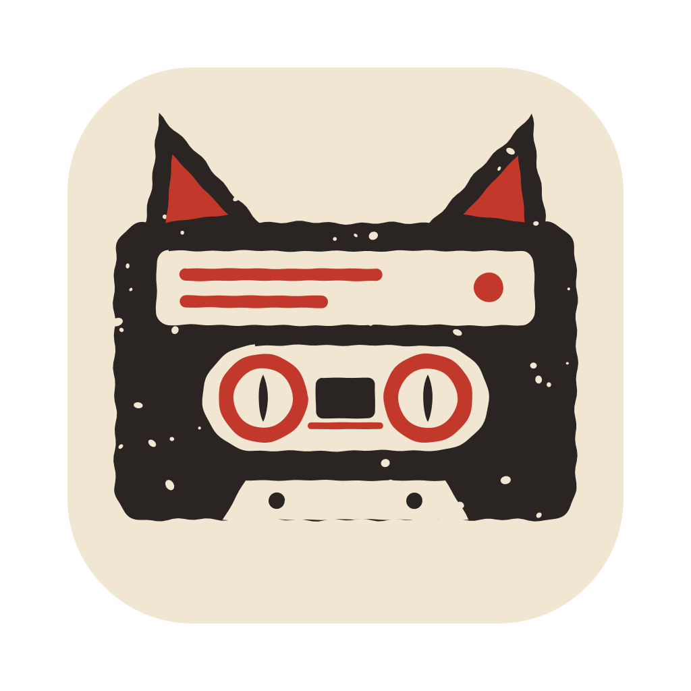
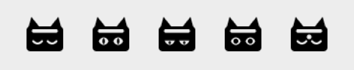

<p align="center">
  
</p>

<h1 align="center">Tapetum</h1>

<p align="center">
  A macOS menu bar app that notices when a call starts, records both sides on separate tracks
  and turns them into a Markdown transcript, using a Whisper server you choose.
</p>

<p align="center">
  <a href="https://github.com/anegoda1995/Tapetum/actions/workflows/ci.yml"></a>
  <a href="https://github.com/anegoda1995/Tapetum/releases/latest"></a>
  
  <a href="LICENSE"></a>
</p>

## What it does

- **Starts by itself.** When an app opens the microphone (Zoom, Teams, Slack, FaceTime, Telegram, WhatsApp,
  Google Meet in a browser), Tapetum starts recording within a fraction of a second and stops a few seconds
  after the call ends.
- **Two tracks.** Your microphone is one track, everything the Mac plays is the other. Each track is transcribed
  on its own, so the transcript knows who said what. With a server that labels speakers, the other side is
  split into Speaker 1, Speaker 2 and so on.
- **No echo in the transcript.** When you talk without headphones, your mic also hears the other side through
  the speakers. Those phrases are dropped from the transcript. Apple's voice processing can also remove the
  echo from the audio itself (Voice Mode), but it is off by default: while it runs, macOS makes the built-in
  mic much quieter for every other app that records it. When the call app runs voice processing itself
  (FaceTime does), Tapetum turns it on too, because only then does it hear you at full level.
- **Real pause.** Nothing from a paused stretch is written to disk. The note marks where the pause was.
- **Plain Markdown.** Each call becomes a note with frontmatter and the recording embedded next to it. It works
  as is in [Obsidian](https://obsidian.md).
- **Your server.** Audio goes only to the transcription server you configure: a self-hosted Whisper server or
  the OpenAI API. If the server is offline, the note appears at once and fills in later.
- **Crash-safe.** A recording cut short by a crash or a restart is finished on the next launch.
- English and Ukrainian.

The name: the tapetum lucidum is the layer behind a cat's retina that makes its eyes shine in the dark.
The other side of the call is recorded through a Core Audio tap.

## Menu bar icon

<picture>
  <source media="(prefers-color-scheme: dark)" srcset="docs/menu-icons-dark.png">
  
</picture>

From left to right: idle, recording, paused, transcribing, waiting for the transcription server.

## Install

Tapetum needs macOS 14.2 or later (that is when Core Audio process taps arrived), on Apple silicon or Intel.

### Download

1. Download `Tapetum-<version>.zip` from [Releases](https://github.com/anegoda1995/Tapetum/releases/latest),
   unzip it and move `Tapetum.app` to Applications.
2. The app is signed ad hoc and not notarized, so macOS blocks the first launch. Clear the download flag once:
   ```
   xattr -dr com.apple.quarantine /Applications/Tapetum.app
   ```
   or open the app, then click Open Anyway in System Settings > Privacy & Security.
3. Open it. macOS asks for the microphone and for "System Audio Recording Only". Tapetum needs both.
4. To start it at login, add it in System Settings > General > Login Items.

### Build from source

Command Line Tools are enough (`xcode-select --install`), Xcode is not needed.

```
git clone https://github.com/anegoda1995/Tapetum.git
cd Tapetum
./install.sh
```

`install.sh` builds the app, copies it to `/Applications` and adds a LaunchAgent that starts Tapetum at login and
restarts it if it ever crashes. The log goes to `~/Library/Logs/Tapetum.log`. `./install.sh --uninstall` removes
the app and the agent and keeps your recordings, settings and notes.

`./build.sh` only builds `build/Tapetum.app`. `UNIVERSAL=1 ./build.sh` builds one binary for both Apple silicon
and Intel.

Every build gets a new ad hoc signature, so macOS asks for both permissions again after each update. If a prompt
does not come back, remove Tapetum from both lists in System Settings > Privacy & Security and open it again.

## Set up transcription

Tapetum sends each track to `POST <serverURL>/v1/audio/transcriptions` with `response_format=verbose_json`,
the OpenAI transcription API. Any server that implements it will do. Until a server is set, recordings and
notes are kept and wait for it.

Create `~/Library/Application Support/Tapetum/config.json`:

```json
{
  "serverURL": "https://whisper.example.com",
  "model": "whisper-1",
  "notesDir": "~/Documents/Obsidian/Calls"
}
```

If the server needs a key, put it into the login Keychain:

```
security add-generic-password -U -s Tapetum -a whisper -w 'YOUR_API_KEY'
```

Tapetum reads the key with the same `security` tool, so the Keychain never asks for permission, even though every
build has a new signature. Quit and reopen Tapetum after changing `config.json`.

With the OpenAI API, keep in mind its 25 MB limit per file: one track of a call takes about 15 MB per hour.

### All settings

Every key in `config.json` is optional.

| Key | Default | Meaning |
| --- | --- | --- |
| `serverURL` | none | Base URL of the transcription server. Without it nothing is uploaded. |
| `model` | `whisper-1` | The `model` field sent to the server. |
| `diarize` | `false` | Sends `diarize=true` with the other side's track, for servers that return a `speaker` per segment. |
| `keychainService`, `keychainAccount` | `Tapetum`, `whisper` | Where the API key is kept in the Keychain. |
| `notesDir` | `~/Documents/Tapetum` | Notes go here, recordings to its `audio` subfolder. |
| `ignoreBundlePrefixes`, `ignoreProcessNames`, `ignorePathFragments` | Siri and dictation | Apps that use the microphone but are not calls. Your entries are added to the defaults. |
| `tapExcludeBundlePrefixes` | none | Apps left out of the other side's track, for example a tool that replays other apps' sound. |
| `endGraceSec` | `5` | The call is over this long after the app released the mic and went silent. |
| `mutedMaxSec` | `1200` | The app released the mic but still plays sound (you muted yourself): keep recording this long. |
| `minRecordingSec` | `20` | Shorter recordings are dropped. |
| `retryIntervalSec` | `600` | How often waiting transcriptions are retried. |
| `silenceThresholdDB`, `systemSilenceThresholdDB` | `-40`, `-65` | A quieter track is not sent to the server (Whisper invents text on silence). |
| `startDelaySec` | `0` | Wait this long after an app opens the mic before recording. |
| `voiceMode` | `false` | Apple voice processing (echo cancellation) on your mic for every call. While it runs, other apps recording the built-in mic get a signal about 40 dB quieter. Calls in apps that use voice processing themselves (FaceTime) get it either way. |
| `fastStart` | `true` | With Voice Mode, record the plain mic while voice processing starts, so the first words are kept. |

## The note

```markdown
---
source: "[[2026-10-06 15-00 Slack.m4a]]"
date: 2026-10-06T15:00:00+03:00
duration: "00:31:12"
app: "Slack"
languages: [en]
speakers: ["Them", "Me"]
---
![[2026-10-06 15-00 Slack.m4a]]

%% tapetum:transcript:start %%
**[00:00:02] Them:** Hi, can you hear me?

**[00:00:04] Me:** Yes, loud and clear.
%% tapetum:transcript:end %%
```

Tapetum only rewrites the block between the two markers and the `languages` and `speakers` lines, so you can
add your own notes and tags while the transcript is on its way. Unclear phrases end with `[unclear?]`.

## Using it

The menu has Pause, Stop Recording, Record Now, Voice Mode (echo cancellation for the current call; new calls
start with the `voiceMode` setting), Record Calls Automatically, Retry Transcription and Open Notes Folder.

From a terminal, with `T=/Applications/Tapetum.app/Contents/MacOS/Tapetum`:

```
$T --send pause|resume|stop|start|voice-on|voice-off|auto-on|auto-off|retry|quit
$T --list-mic        # which processes use the microphone right now, and how Tapetum names them
$T --process <dir>   # finish one recording folder by hand
$T --selftest
```

Recordings in progress, settings and `status.json` (the current state, for scripts) live in
`~/Library/Application Support/Tapetum`.

Tapetum follows the macOS language. To pick its language separately, add it in System Settings > General >
Language & Region > Applications.

## How it works

- **Detection.** Core Audio lists which processes capture from an input device. Tapetum listens for changes to
  those processes and to the input devices, so it reacts the moment a call app opens the mic. Helper processes
  are named after their app (a Chrome helper is "Google Chrome").
- **Your side.** The microphone the call app actually uses, followed when the app switches mics mid-call,
  recorded through an `AVCaptureSession`. With Voice Mode, `AVAudioEngine` with Apple's voice processing takes
  over once it has started, about a second later.
- **The other side.** A global process tap (`CATapDescription`) in a private aggregate device. It records what
  apps play before the volume control, so your volume does not change the recording.
- **Ducking.** Voice processing turns other apps down, the call included. With Voice Mode on, Tapetum takes that
  request back.
- **On disk first.** Both tracks are written in parts next to a manifest, so nothing depends on memory. After the
  call the parts are laid out on one pause-free timeline, encoded as 16 kHz AAC, quiet tracks are raised, and a
  mix goes next to the note. Both tracks are then transcribed in parallel and merged by time.
- **Muted.** When the call app releases the mic for more than 2 seconds (you muted yourself), Tapetum releases it
  too and records only the other side until the app takes the mic again.
- **End of call.** The app released the mic and went silent for 5 seconds, or released the mic but kept playing
  sound for up to 20 minutes.

## Privacy and the law

Tapetum keeps audio on your Mac and sends it only to the server in `serverURL`. It has no telemetry and makes no
other network requests.

Recording a conversation is regulated. In many countries and US states everyone on the call must agree to being
recorded, and data protection rules such as the GDPR may apply. Before you record, make sure you are allowed to:
tell the other people and get their consent where the law requires it. You are responsible for how you use
Tapetum and the recordings it makes.

## Limits

- Many call apps keep the mic open while you are muted in them, and then your mic is still recorded. Use Pause.
- Call apps that use Apple's voice processing themselves (FaceTime, for example) do not tell which microphone they
  use. Tapetum then records the default input.
- An app that holds the microphone for more than 20 seconds becomes a note, for example a long voice message.
  Add such apps to the ignore lists.
- Everything the Mac plays during a call ends up on the other side's track, notifications and music included.
- Switching microphones mid-call loses a moment of your side, about two seconds with Voice Mode on.
- Voice Mode makes the built-in mic about 40 dB quieter for every other app recording it at the same time
  (a voice message, dictation, a call app without its own voice processing). That is why it is off by default.
- Two system interfaces Tapetum uses are not in Apple's public headers: `AudioDeviceDuck`, to take back the
  ducking, and the TCC calls that show the System Audio Recording prompt. A macOS update could change them.

## Development

```
swift build
.build/debug/Tapetum --selftest
python3 scripts/check_strings.py   # every string in the UI has a Ukrainian translation
tests/e2e.sh                       # a fake call from start to note (needs ffmpeg)
tests/crash_and_race.sh            # crash recovery, pause and stop at once, frozen tap, muted call
```

The integration tests run the real app with its own home and notes folders (`TAPETUM_HOME`,
`TAPETUM_NOTES_DIR`). `ffmpeg` holds the mic to fake a call, and the other side comes from a file spoken by
`say`. The terminal needs the microphone permission. The tests only talk to their own instance; an installed
Tapetum keeps running with its automatic recording paused for the run, and the tests will not start while it
records a call. `TEST_CONFIG=<config.json>` puts a server (it adds the transcript checks) or ignore lists
into the test home.

The icons are SVG files in `docs/`: the app icon `icon.svg`, with `icon-32.svg` and `icon-16.svg` drawn for the
small sizes, and the five menu bar states in `docs/menubar/`. `scripts/make-icon.sh` turns them into
`Resources/AppIcon.icns` and `Resources/MenuBar/*.png` (needs `librsvg`), and `Tapetum --render-icons docs`
redraws the menu bar picture above.

## Contributing

Pull requests go to the `dev` branch, the default one. `main` only moves when a release is made: a pull request
from `dev` to `main`, then a `v<version>` tag on `main` (with `CFBundleShortVersionString` in
`Resources/Info.plist` raised to match). GitHub Actions checks every pull request and builds and publishes the
universal app for every tag.

## License

Tapetum is free software under the [GNU General Public License v3.0 or later](LICENSE). You may use, study,
change and share it, but every copy and every changed version you distribute must stay under the same license,
with its source code.

Tapetum is not affiliated with Apple, Zoom, Microsoft, Slack, Google, Meta, Telegram, OpenAI or Obsidian. Their
names only describe what Tapetum works with. The way it asks for the system audio permission follows the
[AudioCap](https://github.com/insidegui/AudioCap) sample by Guilherme Rambo.
